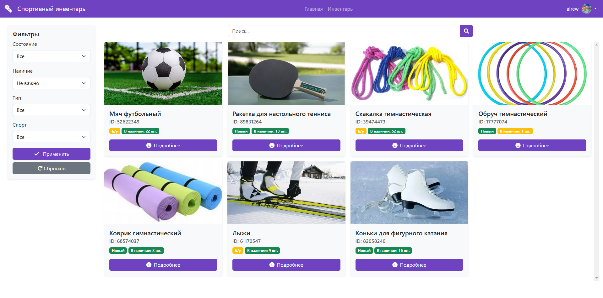

## Краткое описание проекта

Проект представляет собой веб-сайт для управления спортивным инвентарём, разработанный с использованием HTML, CSS, PHP, MySQL и GitHub. Сайт предназначен для хранения информации о спортивном инвентаре, его распределении между пользователями и отслеживании истории использования. Пользователи смогут добавлять инвентарь в избранное, просматривать информацию о нём и оставлять запросы на использование. Администраторы смогут управлять доступом пользователей к инвентарю и отслеживать статистику использования

**Ссылка на демо-версию сайта:** http://rewarny.atwebpages.com/

---
## Инструкция по установке/развертыванию

1. Установите [PHP](https://www.php.net/downloads.php) версии 8.0 или новее
2. Подключите библиотеку MySQLi
3. В файле utils.php измените данные для подключения к базе данных
4. Поместите все файлы в корневую папку

---
## Видео-демонстрация функций сайта

https://rutube.ru/video/d86208dad3191ce5e5810b3fdf9c41db/